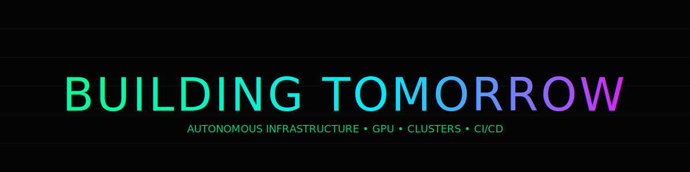

  

  

 

  

### ⚡ Tech Stack

## 🏆 TOP Projects

| SYSTEM | LINK | STACK | POWER |
|--------|------|-------|-------|
| CLUSTER CORE | [build-net](https://github.com/denezt/build-net) | `Python` `IaC` | 🟩🟩🟩🟩 |
| GPU LAB | [gpu-programming](https://github.com/denezt/gpu-programming) | `C` `CUDA` | 🟩🟩🟩 |
| NETWORK OPS | [advanced-networking-tools](https://github.com/denezt/advanced-networking-tools) | `Shell` `Security` | 🟩🟩🟩 |
| JAVA ENGINE | [java-coding-examples](https://github.com/denezt/java-coding-examples) | `Java` `Patterns` | 🟩🟩 |
| DATA LAB | [datasciencecoursera](https://github.com/denezt/datasciencecoursera) | `R` `ML` | 🟩🟩 |

[LINKEDIN](https://www.linkedin.com/in/uruscg)  
[WEBSITE](https://www.garagebarge.com)

